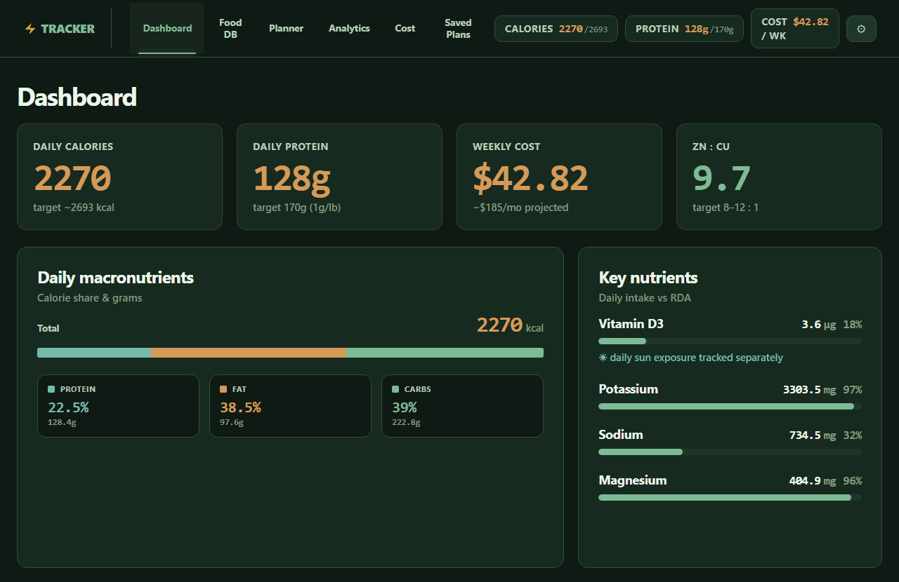

# Nutrition Analytics Tracker

I wanted to plan a week of food and see the nutrients and the cost in one place, so I wrote this app. It's built with React and runs in the browser with no server: you keep your own food list, set weekly amounts, and it shows macros, vitamins, minerals and cost per day and per week.



## What it does

- Food list with nutrition per 100 g, unit conversion and price per unit.
- Search and import from USDA FoodData Central, one food at a time or in bulk for the whole list.
- Every value remembers where it came from (USDA or typed in by hand), so an import never replaces a value I entered myself.
- Weekly planner, a dashboard with daily and weekly totals and charts, a cost page and saved plan versions.
- JSON and CSV import and export.

## How it's built

React 19, Vite 7 and Recharts. Everything is saved in the browser's `localStorage`.

- `src/pages/`: one file per page (Dashboard, Database, Planner, Analytics, Cost, Versions).
- `src/services/`: the USDA API calls and the mapping from its nutrient IDs to the app's fields.
- `src/utils/`: the totals, the merge rules for manual and imported values, and CSV reading and writing.
- `src/data/`: the sample foods and plans.

## Run

```bash
npm install
npm run dev
```

USDA lookups work with the public `DEMO_KEY`, which allows about 30 requests an hour. For more, get a free key at <https://fdc.nal.usda.gov/api-key-signup.html> and set `VITE_USDA_API_KEY` in `.env` (see `.env.example`). The key ends up in the built app, so don't commit `.env`.

`npm run electron` opens the same app as a desktop window.

## Test

```bash
npm test
```

17 checks: the USDA nutrient mapping, unit conversion, and CSV import and export.

## Limitations

- The built-in foods and plans are sample data with rounded values. They aren't accurate nutrition data.
- Only the USDA mapping, unit conversion and CSV code are tested. The pages have no automated tests.
- Everything is stored in the browser. There is no server and no sync.
- The values for creatine, carnosine, taurine and similar compounds come from a small table of estimates I put together by hand.
